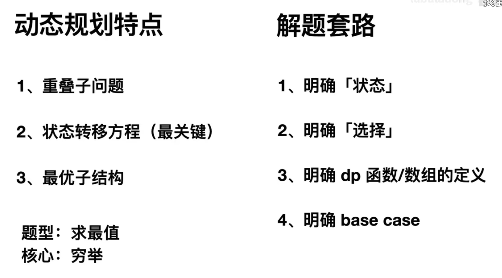
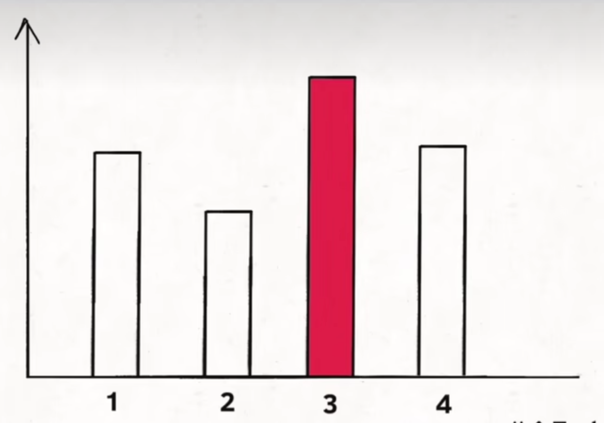
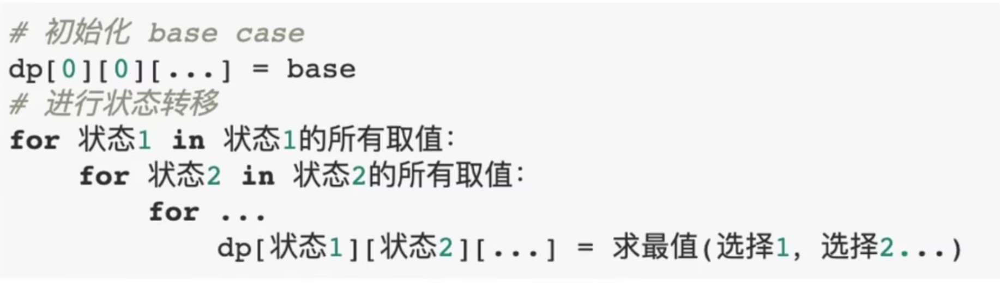
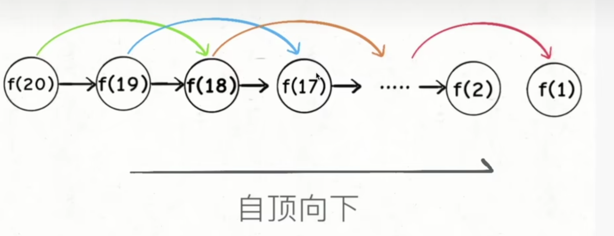
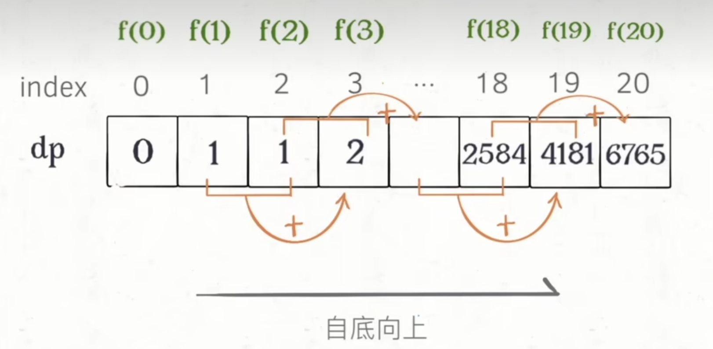
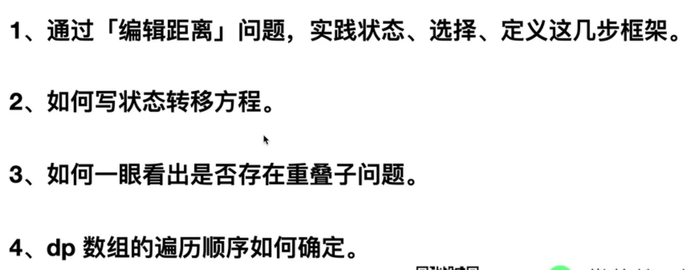

# labuladong



## 動規特點

ex: 求「最..值」問題

核心：窮舉，也就對應著狀態轉移方程的思路

透過狀態轉移方程去窮舉

- 「重疊子問題」和「最優子結構」算是動規的特性，也就是如果發現有這兩個特性，就能判這是個動規的問題
- 「狀態轉移方程」是思路，要自己想

### 重疊子問題

求更小規模的問題～

### 最優子結構

子問題的解，是否可以拿來被父問題所用？

比方說，如果要算全校最高分，那我們可不可以把問題規模先縮減到求所有班級的最高分？

因為所有班級最高分的最大值，就會是全校最高分（無遺漏）

所以可以說，全班最高分是最校最高分的最優子結構

  

但是如果改問，全校最大分差，可否用全班最高分差來求得？

答案是不行，假設A班的最高分是100，最低分是60，則A班最大分差是40

而假設B班的最高分是90，最低分是30，則B班最大分差是60

但是如果放眼全校，則最大分差是100 - 30 ＝ 70

因此這就不是最優子結構了。

## 套路

- 明確「狀態」
   - 會變的就是狀態，比如說函數的參數，數組的index
- 明確選擇
   - 求最值時，一定會遇到選擇
     - 比如硬幣問題，就會遇到不同幣值的選擇
- 明確DP函數／數組的定義
- 明確 base case

範本

  


  

  


## 費式數列

講到爛的東西～但還是要說一次，為什麼這麼重要呢？

推導Fib的三個階段

1. 暴力解（遞迴）
2. memo(優化遞迴)
3. 動態規劃

Fib的最簡寫法，暴解

```java
int fib(int n) {
    if (n <= 1) {
        return n;
    }
    return fib(n - 1) + fib(n - 2);
}
```

在這個階段，時間複雜度為 2^n，因此需要加入memo


```java
int[] memo;

int fib(int n) {
    if (n <= 1) {
        return n;
    }
    if (memo[n] != 0) {
        return memo[n];
    }
    memo[n] = fib(n - 1) + fib(n - 2);
    return memo[n];
}
```

我們可以發現，用遞迴的寫法，都是「自頂向下」到了底部之後再不斷「自底向上」原路返回

  

那麼，直接「自底向上」的寫法，就是動態規劃

  

```java
int fib(int n) {
    if (n == 0) {
        return 0;
    }
    int[] dp = new int[n + 1];
    dp[1] = 1;
    for (int i = 2; i <= n; i++) {
        dp[i] = dp[i - 2] + dp[i - 1];
    }
    return dp[n];
}
```

## 进阶篇

  