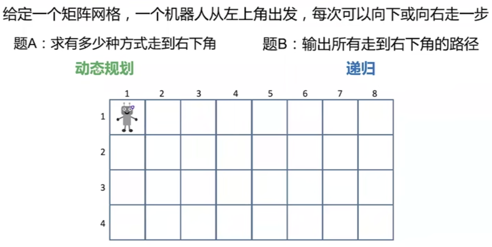
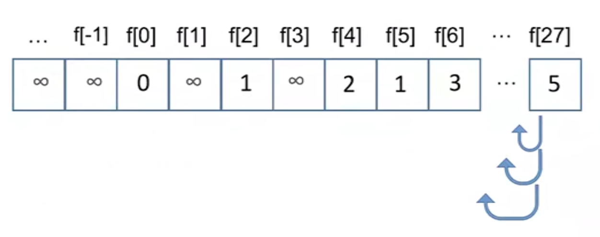

# 九章

https://www.bilibili.com/video/BV1gp4y1t7xe/?vd_source=46aedb9c354da6f47d9f9744b04e265e


 


動規可解決的三大類問題：


1. 計數
   1. for how many ways...
   2. can you...
2. 求最大最小
   1. 比重最高
   2. maximun / minimum cost...etc
   3. 也可能用greedy
3. 求存在性


## 動規四步曲

例子：coin change

有2，5，7三種硬幣，要用最少個硬幣湊出27塊錢，求解

＝＞ 5,5,5,5,7


### 確定狀態


**狀態**在動規中非常重要

在這一步，要確定兩個東西

1. 最後一步
2. 子問題

#### 最後一步

最後一步，就是補上最後一個硬幣的前一步

  

在這題中，問題的本質是求加起來最少的硬幣數

a1 + a2 + .. + ak = 27

前面 a1 + .. + a(k - 1) 枚的總和是 27 - ak

  

切入點～目前唯一知道的是～要湊出27，上一步一定是 (27 - ak) 元

可以用情境去想像，會更貼近

比方說假設ak（最後一枚面值）是5元，因此前面總和就是22元

如果又說 k = 5，則 22 元是由4枚所組成

**在此時，我們會說，22元不可能用少於4枚拼出來，因為已經假設5枚是最優解了，這就造成矛盾**

當然這是結果，如果我們知道前面的答案是4，那麼當然知道答案是5

=> 因此，我們需要求的是～用多少枚硬幣才能求 27 - ak

回顧原問題：用多少枚拼出27，我們的問題還是一樣，只是規模**更小**了 

規模更小的問題就稱為**子問題**


所以但是～我們還不知道 ak 的面值是多少～

只知道可能是2／5／7中其中一種

這時候我們沒辦法馬上做選擇，只能用嘗試的（所以本質上來說，動規也是暴解，不過確實是用了技巧讓它的效能變好，也因此只能去解特定題型）

嘗試 ＝ 那枚硬幣究竟該是2還是5還是7？因為不知道，所以我們只能一邊往下做來得到答案

因此，我們可以說 f(27) = min(f(27 - 2), f(27 - 5), f(27 - 7))

  


那麼，我們可以簡單的把問題用遞歸來解決

```java
int f(int x) {
    if (x == 0) {
        return 0;
    }
    int res = Integer.MAX_VALUE;
    if (x >= 2) {
        res = Math.min(res, f(x - 2) + 1);
    }
    if (x >= 5) {
        res = Math.min(res, f(x - 5) + 1);
    }
    if (x >= 7) {
        res = Math.min(res, f(x - 7) + 1);
    }
    return res;
}
```

##### 遞歸的問題

**效率低下，很多重複計算**

解決方法：
1. 保存計算結果
2. 改變計算順序


### 轉移方程

**f[x]**，代表要用最少枚硬幣湊出x元的**狀態**

注意，這裡從剛才的小括號變成中括號

原因是，剛剛的f(x)是一個函式，而這裡的f[x]是一個數組


每一個 f[x] 的值，都是一個「狀態」(認知這件事很重要)

如果寫出轉移方程，就可以開始寫code了，在面試中大致完成了40%


### 初始條件和邊界情況


邊界：當f(Y)的 Y 小於0，此時已經是不合理的情況（不可能用硬幣拼出-1元，而且負數本質上就不合理）

此時可以直接回傳題意相反的極值來做答案，比如說這題求**最小**個數，當負數出現就回傳**正無窮**

因為正無窮在只要有找出結果的情況下都會被 Math.min() 處理掉，可以用它來表達不合理之意義

如果最後得到的結果還是正無窮，那就回傳 0 或其他沒有結果的答案


初始條件設定準則

1. 狀態方程無法求得
2. 本質上應要有值

比如f(0)，也就是0塊錢的話要怎麼湊，這個問題是合理但是狀態方程是解不出來的

初始條件：都是比較好想的，比方說0個硬幣，0塊錢等等

照理說應該是可以想從27往前減，會到什麼時候終止 


### 計算順序

  

問題：到底要是從小到大，還是從大到小

記一個原則：當我要f(27)時，要確保f(27 - x)已經有答案了

  

  

  

### 小結

  


## 技巧

[62. Unique Paths](https://leetcode.com/problems/unique-paths/)

1. 加法原則：滿足無遺漏且無重複，則可以用加法來處理
   1. 在這題，最後一步的上一步為f(x - 1, y) 和 f(x, y - 1)，由於這兩者不會重複(走到其一就不會走到另一步)且無遺漏(只會從這兩者其一過去)，則適用加法原則，可將解直接相加
2. 如何找dp的維度：把原問題和子問題共同的漢字取出，不一樣的變量就是幾維
   1. 機器人有多少種方式從左上角走到[m - 1, n - 1]
   2. 機器人有多少種方式從左上角走到[m - 2, n - 1] 和 [m - 1, n - 2]
   3. 不同變量有2個，因此狀態DP是二維 
   4. dp[i][j] = 機器人有多少種方式從左上角走到 [i][j]