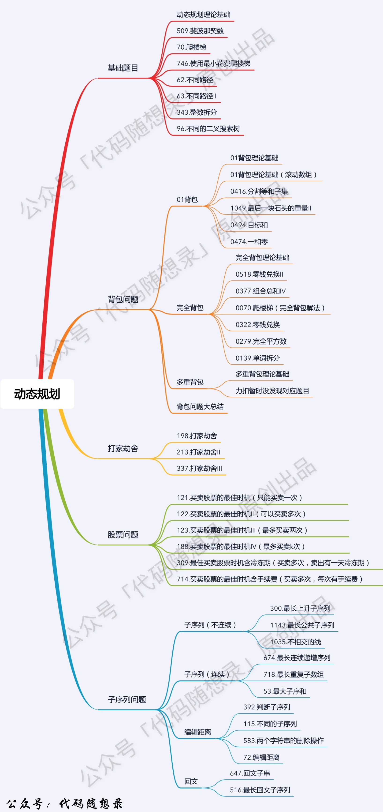

# 代码随想录

- 基礎類題目
- 背包問題
- 股票問題
- 打家劫舍
- 子序列問題

## 萬能五步

1. DP 數組及下標的含義
2. 递推公式
3. DP 數組如何初始化
4. 遍歴順序
5. 打印 DP 數組

## 背包問題

n種物品，每種物品有自己的重量，現有一承重為m的背包，試問最多可以放多少價值的東西進去

- 01背包（重要）
  - n種物品，每種只有一個
- 完全背包
  - n種物品，每種有無限個
- 多重背包
  - n種物品，每種個數各不相同

### 01背包

