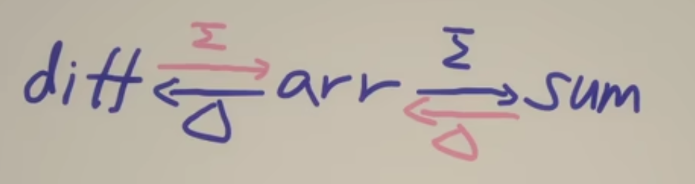

# 異或 XOR

## 前綴和＆差分數組－小定理

- 原數組求進逐一加總，得前綴和
- 原數組求進逐一減去，得差分數組
- 差分數組求進逐一加總，得原數組
- 前綴和求進逐一減去，得原數組



該定理可適用於異或

對於異或來說，若 a ^ b = c， 則 a ^ c = b 

[另可參考](https://www.ruanyifeng.com/blog/2021/01/_xor.html)

## 模版

```java
// 異或前綴和／差分數組
for (int i = 1; i < len; i++) {
    arr[i] = arr[i] ^ arr[i - 1]
}
```

## Practices
### []()